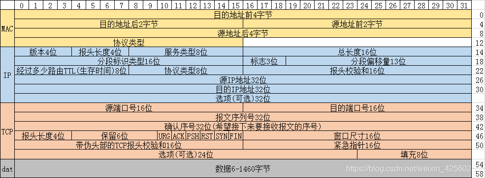
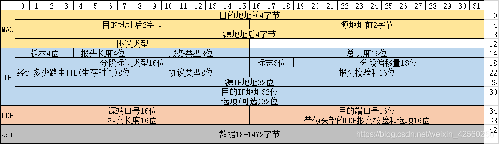

<h1 align="center">
  <a href="https://github.com/medasz/scan_server#readme">
    
  </a>
</h1>

<div align="center">

[](https://go.dev/)
[](https://github.com/medasz/scan_server/blob/main/LICENSE)

</div>
TCP协议数据包格式

UDP协议数据包格式

端口服务识别

> 使用nmap开源的指纹进行端口服务识别,仅用于端口服务识别  


## 📖Table of Contents

* [Quick Start](https://github.com/medasz/scan_server#-quick-start)
* [License](https://github.com/medasz/scan_server#-license)
* [Contributing](https://github.com/medasz/scan_server#-contributing)
* [Credits](https://github.com/medasz/scan_server#-credits)

## 🚀 Quick Start
```shell
scan server

Usage:
  scan_server [flags]

Flags:
  -h, --help             help for scan_server
  -p, --port strings     Scan ports:1-50,88,8080
  -s, --server           Probe open ports to determine service/version info
  -t, --target strings   Scan targets:
                         127.0.0.1,192.168.0.1/24
      --update           update finger
  -v, --version          version for scan_server

Use "scan_server [command] --help" for more information about a command.
```
### Usage Help
```shell
scan_server help
```
### Update fingerprint database

Update the fingerprint database of scan_server

```shell
scan_server --update
```

## TODO
- [x] 解析nmap指纹库
- [x] 更新规则文件
- [ ] 端口服务识别
- [X] 端口协议识别
- [X] 主机存活发现
***
# 参考链接
1. https://www.cnblogs.com/zpchcbd/p/15221460.html
2. https://mp.weixin.qq.com/s?__biz=MzU2NzcwNTY3Mg==&mid=2247484035&idx=1&sn=1919a40c7bac384de3ed38e6cb2b2e04&chksm=fc986ba4cbefe2b2443a2f1b3a61a690f0751e0157bf5d783ff4486c91bf45d1c0f54616f44f&token=325700386&lang=zh_CN#rd
3. https://raw.githubusercontent.com/nmap/nmap/master/nmap-service-probes
4. https://nmap.org/book/vscan-fileformat.html
5. https://nmap.org/book/vscan.html
6. https://www.cnblogs.com/liun1994/p/7041531.html
7. https://www.cnblogs.com/liun1994/p/7041373.html
8. https://www.cnblogs.com/liun1994/p/6986544.html
9. https://colobu.com/2019/06/01/packet-capture-injection-and-analysis-gopacket/
10. https://raw.githubusercontent.com/nmap/nmap/master/nmap-service-probes
# 参考项目
1. https://github.com/CTF-MissFeng/nmaps
2. https://github.com/4dogs-cn/TXPortMap
3. https://github.com/boy-hack/nmap-parser
4. https://github.com/XinRoom/go-portScan
5. https://github.com/tevino/tcp-shaker
6. https://github.com/cloverstd/tcping
7. https://github.com/lcvvvv/gonmap
8. https://github.com/lcvvvv/gomasscan
9. https://github.com/v-byte-cpu/sx
10. https://github.com/XinRoom/go-portScan

## 🤝 Contributing

Contributions, issues and feature requests are welcome.

## 💎 Credits

Logo is designed by [iconduck.com](https://iconduck.com/)

## 📄 License

This project is licensed under the MIT License. See the [License](./LICENSE) file for the full license text.

## 🚨 Disclaimer
I am not responsible for any damages. You are responsible for your own actions. Scanning or attacking targets without prior mutual consent can be illegal.